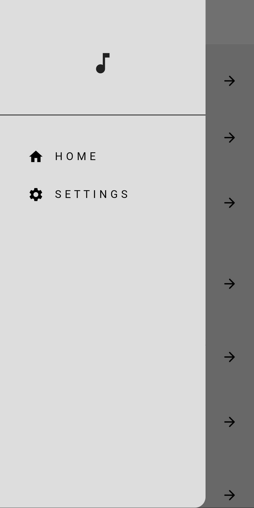
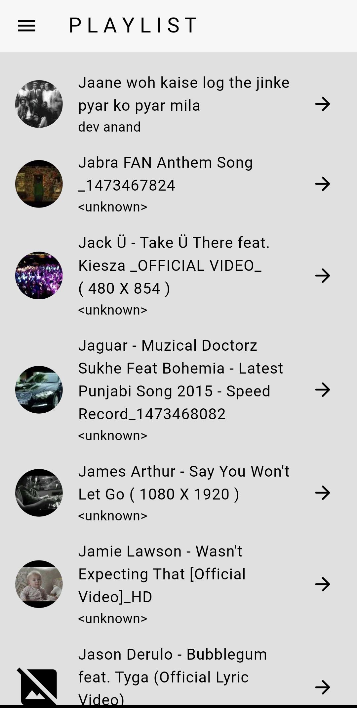
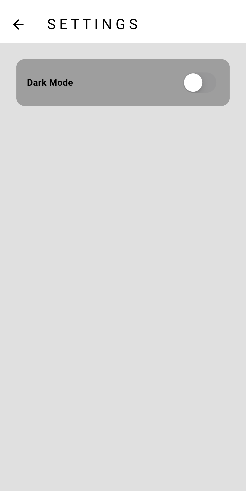
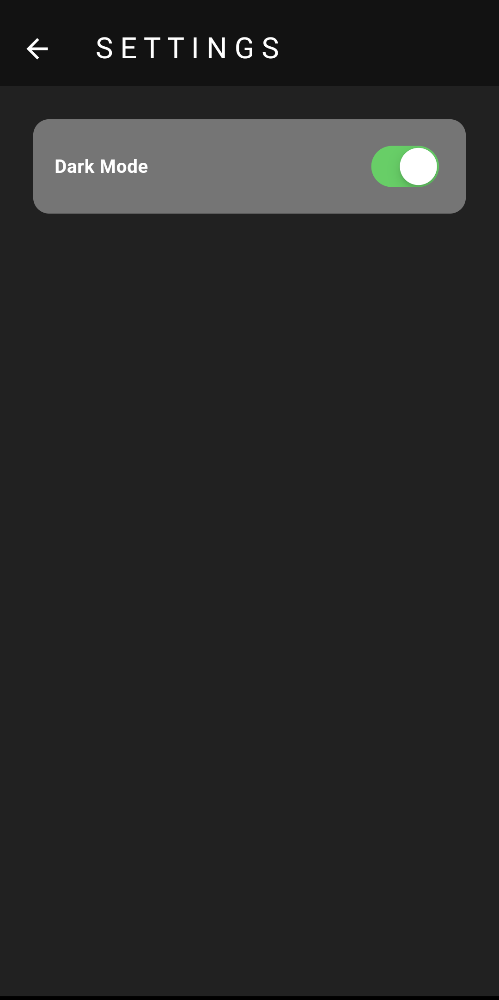
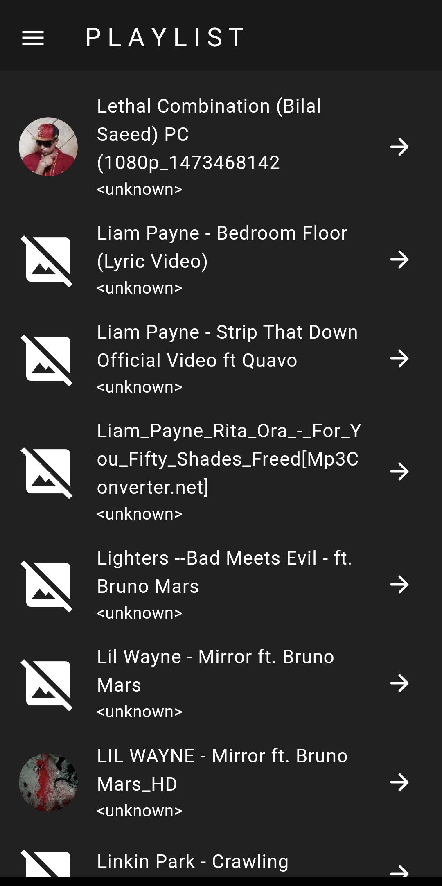

# Minimalistic Music Player App

This project entails a minimalistic Music Player App developed using Flutter and Dart. It incorporates a unique feature allowing users to switch between Light and Dark modes for the user interface.

## Functionality- 
 
- **File Permissions:** The app requests file permissions to access audio files stored in the mobile phone's internal memory.
- **Home Screen:** Upon granting permissions, the app navigates to the Home Screen where it lists all songs alphabetically from the user's device.
- **Song Selection:** Users can click on a song of their choice to start playing it.
- **Player Screen:** Upon selection, the chosen song begins playing instantly. The app transitions to the Player Screen, displaying a progress seek bar and controls for pausing and playing the song.
- **Settings Screen:** The app includes a Settings Screen where users can toggle between Light and Dark modes for the app's UI.

## Libraries Used-
 
- **[File Picker:](https://pub.dev/packages/file_picker)** Reading & accessing file system and file storage of the mobile. 
- **[Audio Players:](https://pub.dev/packages/audioplayers)** Provides audio playing and audio controlling methods and services. 
- **[On Audio Query:](https://pub.dev/packages/on_audio_query)** To query specific song audio files from internal storage.

## Screenshots-

  

 

 
